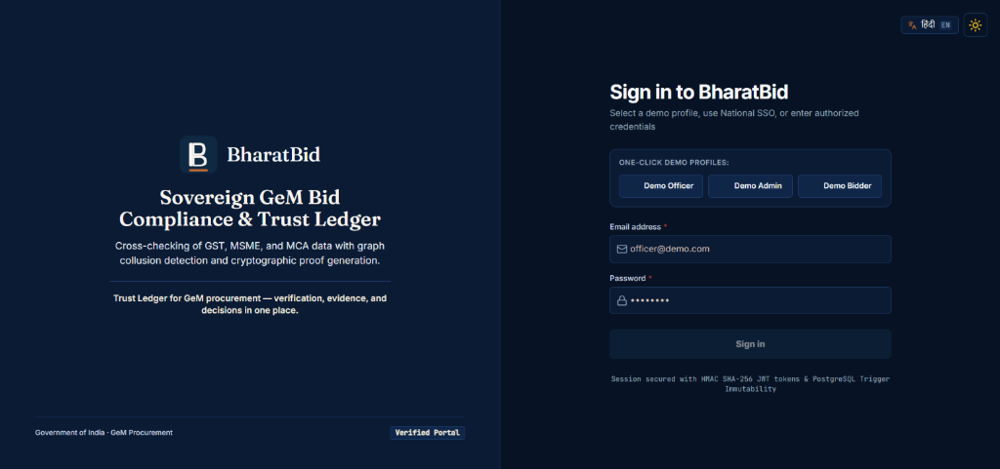
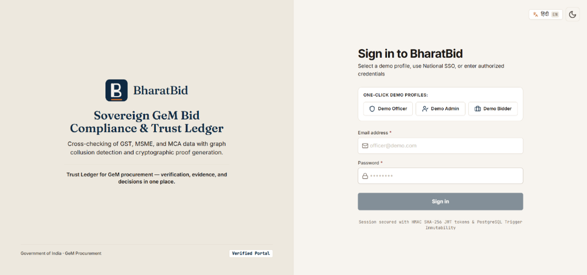
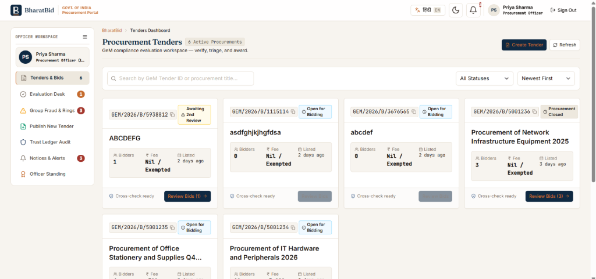
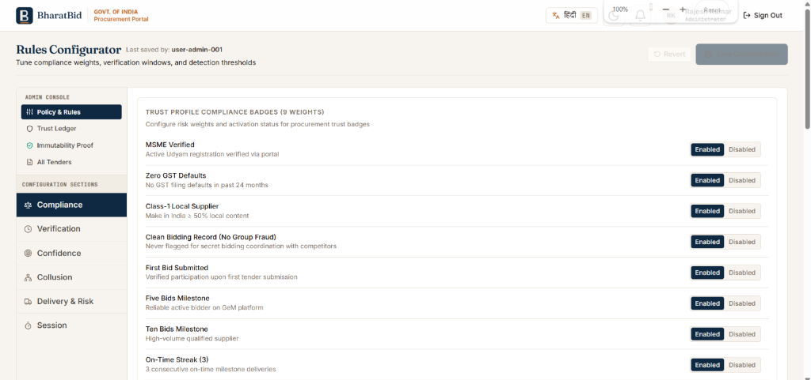
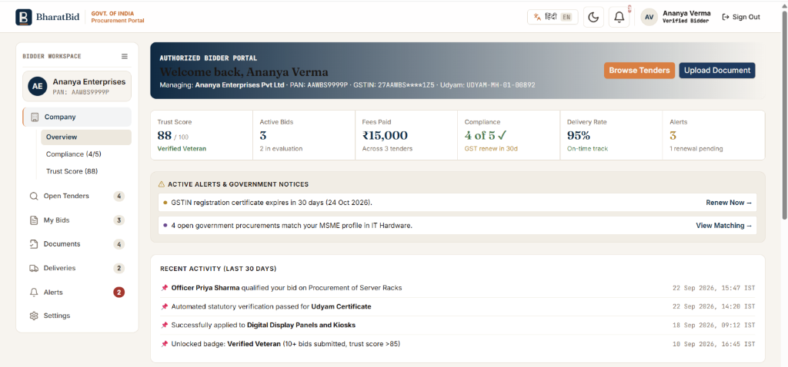

# 🏛️ BharatBid — Sovereign GeM Bid Compliance & Trust Ledger

[](https://gem.gov.in/)
[](#)
[](#)
[](#)
[](#)
[](#)

> **Integrated bid verification, dual-officer governance, and cryptographic trust ledger for Government e-Marketplace (GeM) procurement.**
> Three questions a corruption investigator would ask — answered in running code, not a deck.

---

## 📸 Platform Screenshots

### Login — Government of India · GeM Procurement

| Dark Mode | Light Mode |
|-----------|-----------|
|  |  |

> One-click demo profiles for Officer / Admin / Bidder. HMAC SHA-256 JWT sessions. Sovereign GeM identity throughout.

### Officer Procurement Triage Dashboard



> Risk-sorted tender cards, dual-officer review queue, real-time filter.

### Admin Rules Configurator



> Live-editable compliance weights and confidence thresholds — no code deployment required.

### Bidder Workspace — Company Overview



> Trust Score, Active Bids, Compliance, Delivery Rate, Alerts in one authenticated workspace.

---

## 📑 Table of Contents

1. [The Three Questions](#the-three-questions)
2. [USP 1 — Dual-Officer Maker-Checker Governance](#usp-1--dual-officer-maker-checker-governance)
3. [USP 2 — Immutable Trust Ledger with Live Tamper-Rejection Proof](#usp-2--immutable-trust-ledger-with-live-tamper-rejection-proof)
4. [USP 3 — AI Extraction Separated from Deterministic Decision-Making](#usp-3--ai-extraction-separated-from-deterministic-decision-making)
5. [Complete Feature Inventory](#complete-feature-inventory)
6. [Competitor Comparison](#competitor-comparison)
7. [What's Honestly Simulated](#whats-honestly-simulated)
8. [Architecture](#architecture)
9. [Local Setup](#local-setup)
10. [Demo Credentials](#demo-credentials)

---

## The Three Questions

A compliance platform for public procurement should answer three questions a corruption investigator — not just a procurement officer — would eventually ask:

**1. What exactly is wrong with this bidder?**
A single aggregate risk score doesn't answer this. BharatBid's cross-document evidence matrix answers with the specific field, in the specific document, that conflicts with which other document. _"PAN says 'ABC Industries Pvt Ltd'. GST says 'ABC Industries Private Limited'. Similarity: 68%. Flagged."_ That collapses the officer's manual follow-up work to a single click, not an investigation.

**2. Can we trust that the audit trail wasn't edited after the fact?**
Saying "the ledger is append-only" is a claim. Running the tamper attempt on screen, against the live database, and showing the actual PostgreSQL error in a terminal window is a proof. Claims can be added to any README in five minutes; proofs require the database layer to actually be built the way the claim says.

**3. Could one compromised officer have pushed a decision through alone?**
On most systems, yes. On BharatBid, structurally no: a second independently-assigned officer must concur, with disagreement escalating to a documented admin resolution. Each of these three answers requires a feature that exists in running code — and that combination is what we did not find assembled together in any other GeM compliance tool we reviewed.

---

## USP 1 — Dual-Officer Maker-Checker Governance

Every qualification decision on BharatBid requires two independent officers before it becomes final.

**How it works:**
- Officer A reviews the bidder's evidence and submits a primary decision (Qualify / Disqualify / Request Clarification)
- That decision is recorded as **PENDING** — not final
- A second officer (auto-assigned, never the same person, never reviewing their own decision) sees the pending case in their "Pending My Review" queue
- Officer B reviews identical evidence and either **Concurs** or **Escalates** for discussion
- Escalation routes to an Admin for a documented tie-breaker
- Only after both officers agree does a decision become **FINAL**
- All three layers (primary, secondary, admin) are permanently written to the immutable ledger with name, timestamp, justification, and a minimum-80-character accountability statement

**Why this matters:**
Single-officer procurement sign-off is the principal attack surface for collusion in public procurement — one compromised or coerced individual can approve an ineligible bidder with no check. BharatBid makes that structurally impossible at the software level, not just discouraged by policy. This mirrors the four-eyes principle CVC guidelines require for high-value government financial approvals.

**Configurable triggers (admin panel):**
- Every decision (default for demo)
- Only High or Critical risk bidders
- Only decisions where officer qualification overrides a failed statutory check
- Random audit sampling percentage

---

## USP 2 — Immutable Trust Ledger with Live Tamper-Rejection Proof

Every action on BharatBid — document upload, AI extraction, cross-check, officer decision, fee payment, badge award — is written to a PostgreSQL-backed append-only ledger enforced at two independent database layers.

### Layer 1 — Role-Based Access Control
The application's database user (`backend_app`) is granted only `SELECT` and `INSERT` on the ledger table. `UPDATE` and `DELETE` are not granted at any role level. Even a bug or compromised application process cannot alter history through the normal connection path.

### Layer 2 — PostgreSQL Trigger

```sql
CREATE OR REPLACE FUNCTION reject_ledger_mutation()
RETURNS TRIGGER AS $$
BEGIN
  RAISE EXCEPTION
    'IMMUTABILITY VIOLATION: ledger_entries is append-only. '
    'UPDATE and DELETE are prohibited at the database layer.'
    USING ERRCODE = '55000';
END;
$$ LANGUAGE plpgsql;

CREATE TRIGGER trg_reject_ledger_mutation
BEFORE UPDATE OR DELETE ON "ledger_entries"
FOR EACH ROW EXECUTE FUNCTION reject_ledger_mutation();
```

A row-level trigger fires on any `UPDATE` or `DELETE` attempt regardless of who is asking — **including a `postgres` superuser connecting directly.**

### The Live Proof
The Admin panel has a "Security Test" page with a **"Run Immutability Proof"** button. Clicking it attempts UPDATE and DELETE against the live database and displays the actual PostgreSQL rejection error messages verbatim. This is not a mock — it is the real database refusing in real time.

### Cryptographic Chain
Entries are SHA-256 hash-chained over their canonical RFC 8785 JSON representation. Exports carry an `X-Ledger-Chain-Hash` header. Any retroactive tampering would break the chain and be detectable by independent verification.

### Views Exposed

| View | Role | Description |
|------|------|-------------|
| Per-bidder Trust Ledger tab | Officer | Inside bidder drawer |
| Per-tender Tender Ledger tab | Officer | On tender detail page |
| System-wide Ledger Explorer | Admin | Mode B terminal aesthetic, filterable, exportable CSV/PDF |
| Bid-specific ledger | Bidder | Per downloaded report with `X-Ledger-Chain-Hash` in footer |

---

## USP 3 — AI Extraction Separated from Deterministic Decision-Making

Gemini 2.5 Flash reads uploaded documents and extracts structured fields (PAN, GSTIN, Udyam number, company name, turnover figures, expiry dates) plus a per-extraction confidence score. **That is all Gemini does.**

Whether those extracted values satisfy the tender's requirements is decided entirely by hand-written, auditable, deterministic code:

| Check | Rule |
|-------|------|
| PAN format | `/^[A-Z]{5}[0-9]{4}[A-Z]$/` |
| GSTIN checksum | Standard mod-26 algorithm, pure arithmetic |
| Udyam format | Regex: `UDYAM-[A-Z]{2}-\d{2}-\d{7}` |
| Expiry date | `Math.round((bidDate - expiryDate) / 86400000)` — days expired, no AI |
| Turnover threshold | 3-year average vs tender minimum, queried live from PostgreSQL |
| Name consistency | Levenshtein distance normalized — < 85% similarity = flag |

**The confidence gate sits between AI and decision:**
- ≥ 0.90 → extraction auto-approved, continues to rules
- 0.60–0.90 → flagged for human review before rules run
- < 0.60 → routes to officer — **never guesses**

The extraction logic and the rules engine live in different files with no calls in either direction except through a defined interface. Judges can verify this separation exists as code.

---

## Complete Feature Inventory

### Officer Features

#### Triage Dashboard
- Risk-sorted bidder table showing all bidders on a tender simultaneously
- 5-circle statutory check status per bidder row: **MSME · GST · PAN/ITR · Blacklist · Make in India**
- Each circle: green (verified), amber (partial/warning), red (failed), grey-dashed (not applicable) with hover tooltip explaining check name, status, source, and timestamp
- Click any circle → jump to that specific check pre-expanded in the drawer
- Real-time filter: by risk band, by officer decision status, by search (company, PAN, GSTIN)
- Evaluated Statutory Risk Distribution bar with accurate percentage calculation summing to 100%
- "Detect Collusion" button triggers 6-signal graph analysis across all tender bidders

#### Bidder Detail Drawer (5 Tabs)

| Tab | Contents |
|-----|----------|
| **Overview** | Trust score dial with full arithmetic breakdown, badge grid, key stats |
| **Compliance Checks** | Per-check verification timeline — Upload → AI Extract → Cross-Check → Portal → Confidence Gate → Officer Review. Each stage individually expandable with extracted field values, confidence bar, rule applied, and result |
| **Trust Profile** | Scoring weights, badge history, risk classification reasoning |
| **Officer Decision** | Dual-officer workflow — primary submission, secondary review queue, concur/escalate, admin tie-breaker. 80-character mandatory justification. Live countdown. Button disabled until met |
| **Trust Ledger** | Complete chronological audit trail for this specific bidder |

#### Tender Detail
- Triage Table tab (default)
- Cartel Detection Graph tab: visual relationship map of flagged bidder connections
- Tender Ledger tab: all activity across all bidders on this tender, chronological

#### Award Flow
- Primary award decision with justification
- Secondary officer concurrence required
- Delivery milestone tracking post-award

---

### Admin Features

#### Rules Configurator (live-editable, no code deployment)
- **Compliance**: 9 badge weights with Enabled/Disabled toggle — MSME Verified, Zero GST Defaults, Class-1 Local Supplier, Clean Bidding Record, First Bid Submitted, Five/Ten Bids Milestone, On-Time Streak, Verified Veteran
- **Verification**: per-tier confidence thresholds with explanations
- **Confidence**: Auto-Approve (0.90), Human Review (0.60), Auto-Reject (0.30) — all configurable
- **Collusion**: signal weights per detector (shared director, address, IP, CA, price clustering), aggregate threshold
- **Delivery & Risk**: grace period, milestone scoring
- **Session**: JWT lifetime, rate limit windows
- Save + Revert buttons always visible and enabled when dirty

#### Admin Ledger Explorer (Mode B)
- Full system-wide ledger, Mode B terminal aesthetic (dark bg, monospace)
- Filter by: date range, actor type, action type, bidder ID, tender ID, full-text search
- List ↔ Timeline mode toggle
- Expandable raw JSON per entry
- `X-Ledger-Chain-Hash` displayed, monospace, copyable
- Export: CSV and PDF

#### Security Test — Immutability Proof
- One button: **"Run Immutability Proof"**
- Live terminal output: actual PostgreSQL rejection errors verbatim
- Final status: Layer 1 verified, Layer 2 verified, Trust Ledger is immutable

#### Escalated Decisions
- All bidder reviews where secondary officer escalated disagreement
- Both officers' full reasoning visible side by side
- Admin tie-breaker input with justification field
- Resolution logged to ledger as third decision layer

---

### Bidder Features

#### Sidebar-Navigated Workspace
```
Company
  ├── Overview
  ├── Compliance (4/5)
  └── Trust Score (88)
Open Tenders
  ├── All Open (5)
  ├── Matching My Profile
  ├── Applied
  └── Saved
My Bids
  ├── Active (3)
  ├── Won / Lost
  └── Vault
Documents (4 uploaded)
Deliveries (2)
Alerts (badge count)
Settings
```

#### Company Overview Dashboard
- Trust Score tile (88/100, Verified Veteran)
- Active Bids tile (3, 2 in evaluation)
- Fees Paid tile (₹15,000 across 3 tenders)
- Compliance tile (4 of 5 verified, GST expiry alert)
- Delivery Rate tile (95%, on-time track)
- Alerts tile (3 active)
- Active Alerts & Government Notices panel (expiry warning with "Renew Now", matching tender notice)
- Recent Activity feed (last 30 days, timestamped IST)

#### Compliance Document Vault
Per document type (PAN Card, GST Certificate, OEM Authorization, Udyam MSME, ITR Documents):
- Current version with status pill (Verified / Warning / Failed / Human Review / Pending)
- SHA-256 immutable hash displayed
- Progressive Verification Stepper showing all applicable pipeline stages
- Cryptographic verification block (signed by CA / unsigned / tampered states)
- Expandable rule-by-rule inspection with PASSED/FAILED/WARNING badges and detail
- Replace Document / View Original / Delete actions
- **Delete disabled** when document tied to active bid, with tooltip explaining why

---

### Platform-Wide Features

#### Verification Pipeline (any uploaded document)
```
[Upload]
   │
   ▼ Magic-byte gatekeeper
   │  PNG/JPG/DOCX renamed as .pdf — rejected at byte level
   │
   ▼ MIME-type validation per doc type
   │  PDF-only for PAN/GST/ITR; PDF or XML for Udyam
   │
   ▼ SHA-256 hash computed and displayed
   │
   ▼ Gemini 2.5 Flash extraction (live API call)
   │  PAN · GSTIN · Udyam · Company Name · Turnover · Expiry
   │  Confidence score per field
   │
   ▼ Confidence gate
   │  >= 0.90 auto-approve  |  0.60-0.90 human review  |  < 0.60 inconclusive
   │
   ▼ Generic rules engine (deterministic)
   │  validatePANFormat · validateGSTINFormat · validateUdyamFormat
   │  normalizeCompanyName · nameSimilarity (Levenshtein)
   │  checkExpiry · checkTurnoverThreshold
   │
   ▼ Officer Desk (if confidence gate triggers)
      Routed to human review queue with evidence pre-loaded
```

- **Demo kit** (6 known PDFs): deterministic, offline-safe outcomes for reliable video recording
- `GEMINI_API_KEY` unset → honest "unverified / not configured" result, **never fake pass**
- Progressive stepper UI: stages animate in real time at ~1.2s each, visible for any upload

#### Auth & Security
- JWT (HMAC SHA-256), 12-hour absolute session lifetime with `origIat` preservation
- Role-based access control: Officer / Admin / Bidder, server-side enforced
- Rate limiters: auth (20/15min), verify (5/min), collusion (3/min), vault report (10/min), all with `Retry-After` headers

#### Bilingual UI
- English/Hindi toggle across login, officer triage, tender detail, bidder workspace, status badges, compliance check names, sidebar navigation, common actions
- Devanagari line-height and letter-spacing accommodated separately (`line-height: 1.65`, `letter-spacing: 0.005em`)

#### Design System

| Mode | Use | Colors |
|------|-----|--------|
| **Mode A** (Government Formal) | Officer/bidder views | Navy `#0F2942`, Saffron `#C56B2E`, Cream `#F7F4EF` |
| **Mode B** (Bloomberg Terminal) | Admin Ledger Explorer | Terminal bg `#0C0F14`, Amber accent |

Fonts: **Fraunces** (numeric displays) · **Inter** (UI) · **JetBrains Mono** (IDs/hashes) · **Noto Sans Devanagari** (Hindi)
WCAG 2.1 AA contrast throughout.

#### Testing & Reliability
- **275 automated tests** across 22 test files
- Schema-isolated from demo data (Vitest, `schema=test`)
- CI/CD via GitHub Actions
- Docker + Docker Compose for consistent deployment

---

## Competitor Comparison

> These are four genuinely different tools solving different problems. BharatBid occupies a specific gap none of them fill.

| Capability | Minaions | SAP Ariba | SIH Prototypes (OPAL / VeriBid) | **BharatBid** |
|---|---|---|---|---|
| **Primary user** | Bidders / tendering MSMEs | Enterprise procurement teams | Procurement officers | **Procurement officers + bidders** |
| **Core purpose** | Tender discovery, bid preparation | Supplier lifecycle, ERP integration | Bid compliance decision support | **Integrated bid verification + dual-officer governance** |
| Tender discovery | ✓ Core | — | — | — |
| GeM-specific | Strong | Not GeM-specific | GeM-specific | **✓ GeM-specific** |
| AI document extraction | OCR / multilingual | Document management | Present | **✓ Gemini 2.5 Flash, live extraction** |
| Deterministic rules separate from AI | Not disclosed | Not applicable | Present in strongest teams | **✓ Explicit, separate code layer** |
| Confidence-gated human review | Not core | Approval workflows | Present in some | **✓ Admin-configurable 3-threshold gate** |
| Cross-document consistency matrix | Limited | Supplier-data focused | Present in strongest teams | **✓ PAN/GST/Udyam/ITR cross-checked** |
| **Dual-officer sign-off (maker-checker)** | Not applicable | Approval workflow exists | Not found in public repos reviewed | **✓ Primary + secondary + admin tie-breaker** |
| Anti-collusion graph detection | Not core | Supplier risk (different concept) | Present in at least one (OPAL) | **✓ 6-signal weighted detector** |
| **Immutable ledger — live tamper-rejection demo** | Not core | Enterprise audit logs | Audit trails present; live proof not found | **✓ Dual-layer DB defense, demonstrable on-screen** |
| Government registry integration | Portal ecosystem | Enterprise/ERP APIs | Mix of live and mock adapters | Adapter architecture, **SIMULATION MODE labeled in UI** |
| Bilingual (English/Hindi) | India-focused | Enterprise/global | SIH prototypes generally | **✓ Shipped across all roles** |
| Progressive verification UI (stage-by-stage) | Not applicable | Not applicable | Not typically shown | **✓ Real-time stepper, ~1.2s per stage** |
| Bidder workspace | Strong seller workflow | Supplier self-service | Yes / partial | **✓ Full sidebar workspace** |
| Officer triage (bulk, one screen) | Not applicable | Enterprise dashboards | Present | **✓ Risk-sorted, one screen, all bidders** |
| Admin live-editable rules (no redeploy) | Not applicable | Enterprise config | Some | **✓ Full Rules Configurator** |
| Honest scope disclosure | — | — | Varies | **✓ SIMULATION MODE badge in UI, not only in README** |

---

## What's Honestly Simulated

One line per item, no softening:

| Item | Status |
|------|--------|
| GST / PAN / Udyam **portal status lookups** (ACTIVE/INACTIVE from real registries) | Simulated adapter, labeled **SIMULATION MODE** in the UI |
| DigiLocker cryptographic signature | Verified against a demo CA trust store, not the production CCA root |
| MCA21 / EPFO / debarment registry checks | Simulated adapter |
| Production MeriPehchan OIDC login | Pending MeitY partnership; demo uses email/password |

Everything that actually determines compliance outcomes — extraction, cross-checks, format validation, expiry arithmetic, turnover calculation, confidence gating, officer workflow, ledger immutability — **is real, runs against actual uploaded documents, and is independently verifiable by cloning the repository.**

---

## Architecture

```
┌──────────────────────────────────────────────────────────────────┐
│                       BHARATBID FRONTEND                         │
│     React 19 + TypeScript + Vite  (Bilingual: English / हिन्दी)  │
└─────────────────────────┬────────────────────────────────────────┘
                          │ REST / Multipart FormData
                          ▼
┌──────────────────────────────────────────────────────────────────┐
│                    EXPRESS.JS BACKEND API                         │
│   [CORS] [Rate Limiter] [RBAC JWT Auth] [Zod Validation]        │
└──────────┬───────────────────────┬──────────────────┬───────────┘
           │                       │                  │
           ▼                       ▼                  ▼
┌────────────────────┐  ┌────────────────────┐  ┌────────────────┐
│ Verification       │  │ Collusion Detector  │  │ Rules Engine   │
│ Pipeline           │  │ - Director graph    │  │ - Trust score  │
│ - Magic bytes      │  │ - IP/Address match  │  │ - Badge calc   │
│ - SHA-256          │  │ - Bid clustering    │  │ - Weighted     │
│ - Gemini extract   │  │ - CA fingerprint    │  │   compliance   │
│ - Confidence gate  │  │ - 6 weighted signals│  └────────────────┘
│ - Rules engine     │  └────────────────────┘
└────────┬───────────┘
         │
         ▼
┌──────────────────────────────────────────────────────────────────┐
│               POSTGRESQL TRUST LEDGER (PORT 5432)                │
│  - Append-only table: ledger_entries (SHA-256 hash-chained)      │
│  - Row trigger: reject_ledger_mutation() (blocks UPDATE/DELETE)  │
│  - Role: backend_app (SELECT + INSERT only)                      │
└──────────────────────────────────────────────────────────────────┘
```

---

## Local Setup

### Prerequisites
- **Node.js** `v18+`
- **npm** `v9+`
- **PostgreSQL** on port `5432`
- **Git**

### Database
```sql
CREATE DATABASE gem_compliance;
```

### Backend
```powershell
cd backend-api
npm install
# Copy .env.example -> .env and configure:
# DATABASE_URL, JWT_SECRET, GEMINI_API_KEY (optional for live extraction)
npx prisma db push
node scripts/fix-enum.js
npm run seed
npm run dev
# -> http://localhost:4000
```

### Frontend
```powershell
cd bharatbid
npm install
npm run dev
# -> http://localhost:3000
```

---

## Demo Credentials

The login page contains **one-click demo profile buttons** for instant access:

| Role | Email | Password | Access |
|------|-------|----------|--------|
| **Procurement Officer** | `officer@demo.com` | `demo1234!` | Evaluate tenders, trigger verification, review bids, dual-officer sign-off |
| **Governance Admin** | `admin@demo.com` | `demo1234!` | Ledger explorer, immutability proof, live rules configurator |
| **MSME Bidder** | `bidder@demo.com` | `demo1234!` | Upload documents, view verification pipeline, apply for tenders |

---

## Repository

- **Branch**: `feature/bharatbid-platform`
- **Repo**: [https://github.com/SIH-PROJECT100/SIH-100](https://github.com/SIH-PROJECT100/SIH-100)

---

*Built for the Government of India · GeM Procurement — verification, evidence, and decisions in one place.*